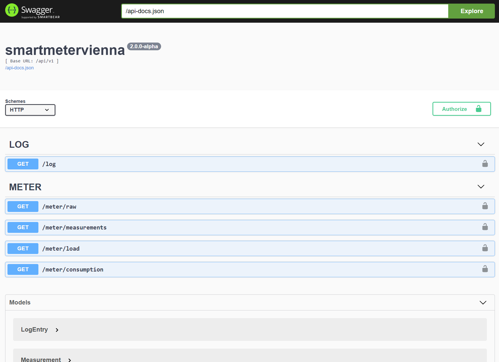
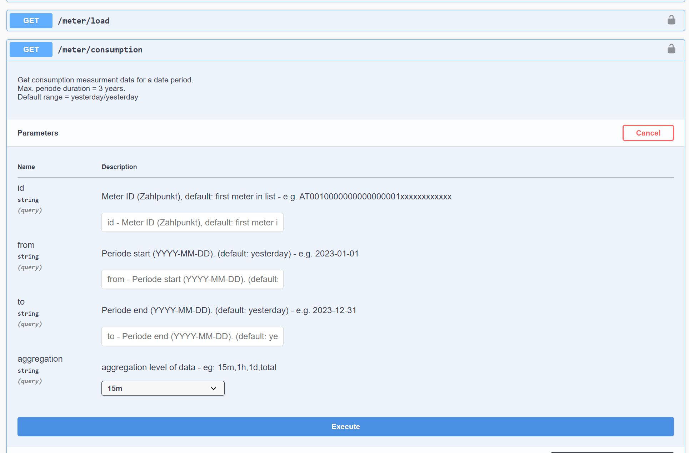
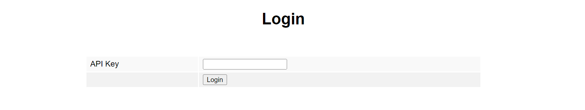
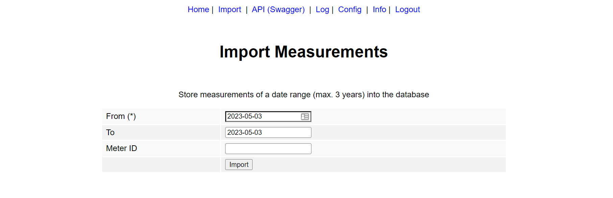
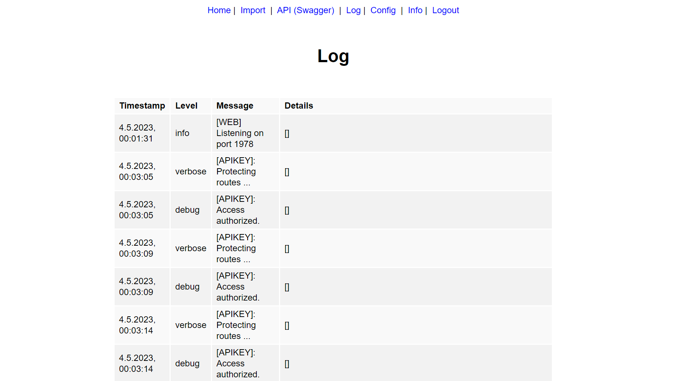
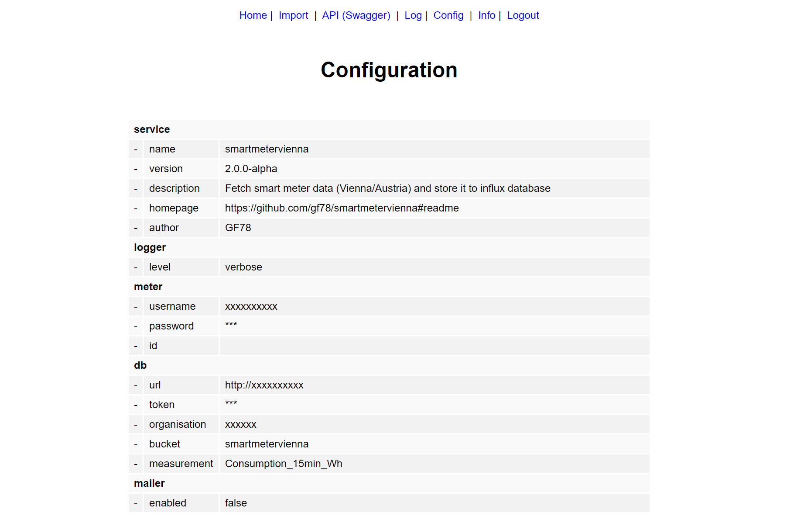
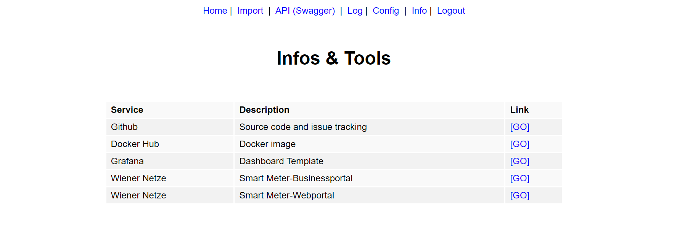

# SmartMeter Vienna

- Github: https://github.com/gf78/smartmetervienna/
- Docker Hub: https://hub.docker.com/r/gf78/smartmetervienna

# Table of Contents

- [Features](#features)
- [Screenshots](#screenshots)
- [Prerequisites](#prerequisites)
- [Installation](#installation)
- [Configuration](#configuration)
- [Manual import](#manual-import)
- [Cron Job](#cron-job)
- [Rest API](#rest-api)
  - [Meter](#meter)
  - [Log](#log)
- [Web UI](#web-ui)
- [Notifications](#notifications)
  - [Email](#email)
  - [Webhook](#webhook)
- [Grafana](#grafana)

## Features

- Support **smart meters** used in **Vienna** by Wiener Netze
- Retrieve **power consumption** and **avg. load** for a single day or for a date range (max. 3yrs)
- Store values into **influx database** (V2)
- **Import measurements** for a single day or a date range manually via the web UI
- Run daily **cron job** to store data of prev. day(s)
- Retrieve measurement data via **Rest API**
- Optional API-KEY **authorization**
- **Swagger**: API definition and interactive web UI
- Check service configuration and log on **web UI**
- Receive **email notifications** about cron job result
- Trigger **webhook requests** on cron job run
- **Grafana** dashboard JSON model included
- Extensive **logging** service
- **Dockerized** based on **Alpine Linux** image

## Screenshots

### Grafana Dashboard


### Swagger UI for Rest API





### Web UI












## Prerequisites

- Customer of Wiener Netze
- Smart meter installed
- Account created https://smartmeter-web.wienernetze.at/
- Opt in to 15 minutes interval measurements

## Installation

Edit the `docker-compose.yml`file and create a new docker container:

```yaml
version: "3.3"
services:
  smartmetervienna:
    container_name: smartmetervienna
    image: "gf78/smartmetervienna:latest"
    restart: unless-stopped
    ports:
      - "80:1978"
    environment:
      PORT: 1978
      API_KEY: "xxx"
      LOG_LEVEL: "error"
      CRON_SCHEDULE: "0 12 * * *"
      CRON_DAYS_IN_PAST: "7"
      LOGWIEN_USERNAME: "xxx"
      LOGWIEN_PASSWORD: "xxx"
      INLUXDB_URL: "http://xxx:8086"
      INLUXDB_ORGANISATION: "xxx"
      INLUXDB_BUCKET: "smartmetervienna"
      INLUXDB_MEASUREMENT: "Consumption_15min_Wh"
      INLUXDB_TOKEN: "xxx"
      SMTP_HOST: "xxx"
      SMTP_PORT: 587
      SMTP_SECURE: false
      SMTP_CIPHERS: "SSLv3"
      SMTP_USERNAME: "xxx"
      SMTP_PASSWORD: "xxx"
      SMTP_FROM: "xxx"
      SMTP_TO: "xxx"
      MAIL_ENABLED: false
      MAIL_SUBJECT: "SmartMeter Vienna"
      MAIL_ON_SUCCESS: true
      MAIL_ON_FAILURE: true
      MAIL_ON_RESTART: true
      WEBHOOK_ENABLED: false
      WEBHOOK_METHOD: POST
      WEBHOOK_URL_RESTART: "http(s)://xxx"
      WEBHOOK_URL_SUCCESS: "http(s)://xxx"
      WEBHOOK_URL_FAILURE: "http(s)://xxx"
    volumes:
      - "smartmetervienna-logs:/logs"
volumes:
  smartmetervienna-logs:
    external: true
    name: smartmetervienna-logs
```

## Configuration

Use the following environment variables to configure the service

| Variable             | Description                                                                                                                | Mandatory |
| -------------------- | -------------------------------------------------------------------------------------------------------------------------- | --------- |
| PORT                 | Web UI port `1978`                                                                                                         | no        |
| API_KEY              | Secure Web UI and Rest API                                                                                                 | no        |
| LOG_LEVEL            | Level of logging service `error`, `info`, `verbose`                                                                        | no        |
| CRON_SCHEDULE        | Schedule for cron job `0 10,16 * * *`                                                                                      | no        |
| CRON_DAYS_IN_PAST    | Number of days in the past should be imported                                                                              | no        |
| LOGWIEN_USERNAME     | Username for smart meter portal of Wiener Netze                                                                            | yes       |
| LOGWIEN_PASSWORD     | Password for smart meter portal of Wiener Netze                                                                            | yes       |
| METER_ID             | Meter id (Zählerpunkt) of Wiener Netze                                                                                     | no        |
| INLUXDB_URL          | URL of influx db `http://xxx:8086`                                                                                         | no        |
| INLUXDB_TOKEN        | Token of influx db                                                                                                         | no        |
| INLUXDB_ORGANISATION | Organisation of influx db                                                                                                  | no        |
| INLUXDB_BUCKET       | Bucket of influx db (default: smartmetervienna)                                                                            | no        |
| INLUXDB_MEASUREMENT  | Measurement name for influx db (default: Consumption_15min_Wh)                                                             | no        |
| SMTP_HOST            | SMTP server host                                                                                                           | no        |
| SMTP_PORT            | SMTP server port `587`                                                                                                     | no        |
| SMTP_SECURE          | SMTP server sercurity `true`, `false`                                                                                      | no        |
| SMTP_CIPHERS         | SMTP server ciphers `SSLv3`                                                                                                | no        |
| SMTP_USERNAME        | SMTP server username                                                                                                       | no        |
| SMTP_PASSWORD        | SMTP server password                                                                                                       | no        |
| SMTP_FROM            | Sender email address                                                                                                       | no        |
| MAIL_ENABLED         | Email notifications enabled: `true`, `false`                                                                               | no        |
| MAIL_TO              | Receipients email address                                                                                                  | no        |
| MAIL_SUBJECT         | Email subject                                                                                                              | no        |
| MAIL_ON_SUCCESS      | Send otifications on success: `true`, `false`                                                                              | no        |
| MAIL_ON_FAILURE      | Send otifications on failure: `true`, `false`                                                                              | no        |
| MAIL_ON_RESTART      | Send otifications on restart: `true`, `false`                                                                              | no        |
| WEBHOOK_ENABLED      | Webhook notifications enabled: `true`, `false`                                                                             | no        |
| WEBHOOK_METHOD       | Webhook protocol: `POST`, `GET`                                                                                            | no        |
| WEBHOOK_URL_RESTART  | Webhook URL on restart                                                                                                     | no        |
| WEBHOOK_URL_SUCCESS  | Webhook URL on success, supported placeholders `%%FROM%%`, `%%TO%%`, `%%DAYS%%`, `%%COUNT%%`, `%%RATE%%` and `%%SUCCESS%%` | no        |
| WEBHOOK_URL_FAILURE  | Webhook URL on failure, supported placeholders `%%FROM%%`, `%%TO%%`, `%%DAYS%%`, `%%COUNT%%`, `%%RATE%%` and `%%SUCCESS%%` | no        |

## Cron Job

Set `CRON_SCHEDULE` ENV variable for example to `"0 10,16 * * *` to request daily at 10am and 4pm the measurements of the last day(s) and store them into the database. If enabled you will receive email and/or webhook notifications on success/failure. It is recommended to set `CRON_DAYS_IN_PAST` to a value greater than 1 to import measurements that where not provided in time by Wiener Netzte on one of the following days.

Schedule format: https://crontab.guru/

## Rest API

See swagger file for more details.

### Security

Set a value for the ENV variable `API_KEY` to activate the authorization for the Rest API and the Web UI. The ApiKey can be provided as header, query param or cookie.

### Meter

- Original response of SmartMeter-Portal: `/api/v1/meter/raw?from=YYYY-MM-DD&to=YYYY-MM-DD`
- Basic measurements for DB storage: `/api/v1/meter/measurements?from=YYYY-MM-DD&to=YYYY-MM-DD`
- Enhanced consumption measurements `/api/v1/meter/consumption?from=YYYY-MM-DD&to=YYYY-MM-DD`
- Enhanced load measurements `/api/v1/meter/load?from=YYYY-MM-DD&to=YYYY-MM-DD`

```json
[
  {
    "measurement": "Consumption",
    "unit": "Wh",
    "value": 97,
    "timestamp": "2023-03-31T22:00:00.000Z",
    "start": "2023-03-31T22:00:00.000Z",
    "end": "2023-03-31T22:14:59.999Z",
    "text": "97Wh"
  },
  {}
]
```

### Log

- Get log of the current day: `/api/v1/log`

```json
[
  {
    "level": "info",
    "message": "[WEB] Listening on port 1978",
    "timestamp": "2023-04-27T06:45:46.806Z"
  },
  {}
]
```

## Web UI

Access the status page: `//your-server:your-port/`

- Home: Check current version and if update is available
- Import: Manually trigger import of measurements to database
- Log: Check log entries
- Config: Check current configuration
- Info: Further information and links

## Notifications

### Email

Configure the SMTP/Email service to receive emails in case of `restart`, cron job `success` and cron job`failure`.

### Webhook

Configure the webhook service to receive `GET` or `POST` webhook requests in case of `restart`, cron job `success` and cron job `failure`. The payload of a `POST` request will include the retrieved measurement data.

Use the following placeholder in the URL if needed: `%%FROM%%`, `%%TO%%`, `%%DAYS%%`, `%%COUNT%%`, `%%RATE%%` and `%%SUCCESS%%`

## Grafana

Feel free to use the included [Grafana Dashboard Model](grafana/dashboard.json).
