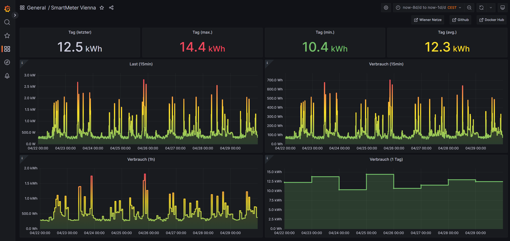
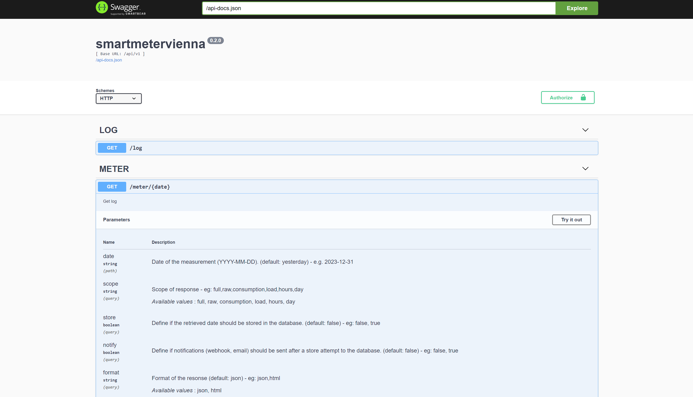
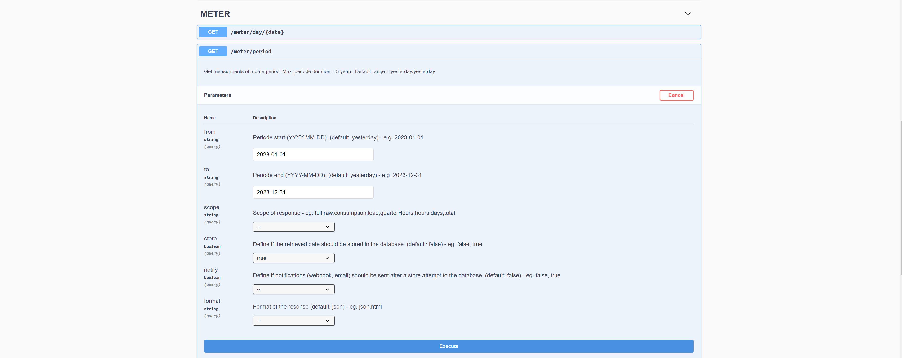
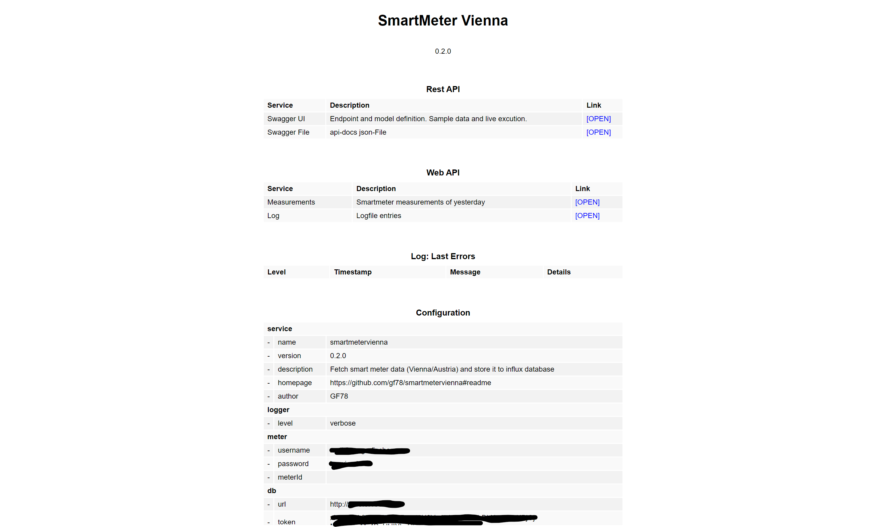
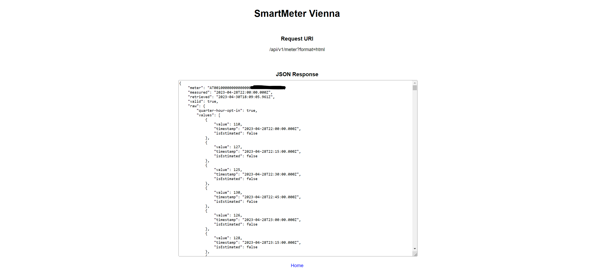

# SmartMeter Vienna

- Github: https://github.com/gf78/smartmetervienna/
- Docker Hub: https://hub.docker.com/r/gf78/smartmetervienna

# Table of Contents

- [Features](#features)
- [Screenshots](#screenshots)
- [Prerequisites](#prerequisites)
- [Installation](#installation)
- [Configuration](#configuration)
- [Cron Job](#cron-job)
- [Rest API](#rest-api)
  - [Meter](#meter)
  - [Log](#log)
- [Web UI](#web-ui)
- [Notifications](#notifications)
  - [Email](#email)
  - [Webhook](#webhook)
- [Grafana](#grafana)

## Features

- Support **smart meters** used in **Vienna** by Wiener Netze
- Retrieve **power consumption** for a specific day or for a date range (max. 3yrs)
- Store values to **influx database** (V2)
- Run daily **cron job** to store data of prev. day
- Retrieve data via **REST API** without authorization
- **Swagger**: api-docs.json download, interactive Web UI
- Manually import measurements for date range (swagger UI)
- Check service status on **Web UI**
- Receive **email notifications** about data update status
- Trigger **webhook requests** based on update status
- **Grafana** dashboard JSON model included
- Extensive **logging** service
- Fully **dockerized** based on **Alpine Linux** image

## Screenshots

### Grafana Dashboard



### Swagger UI for Rest API



### Import measurement for a period



### Web UI: Service status



### Web UI: Measurements



## Prerequisites

- Customer of Wiener Netze
- Smart meter installed
- Account created https://smartmeter-web.wienernetze.at/
- Opt in to 15 minutes interval measurements

## Installation

Edit the `docker-compose.yml`file and create a new docker container:

```yaml
version: "3.3"
services:
  smartmetervienna:
    container_name: smartmetervienna
    image: "gf78/smartmetervienna:latest"
    restart: unless-stopped
    ports:
      - "80:1978"
    environment:
      PORT: 1978
      LOG_LEVEL: "error"
      CRON_SCHEDULE: "0 0 10,16 * * *"
      LOGWIEN_USERNAME: "xxx"
      LOGWIEN_PASSWORD: "xxx"
      INLUXDB_URL: "http://xxx:8086"
      INLUXDB_ORGANISATION: "xxx"
      INLUXDB_BUCKET: "smartmetervienna"
      INLUXDB_MEASUREMENT: "Consumption_15min_Wh"
      INLUXDB_TOKEN: "xxx"
      SMTP_HOST: "xxx"
      SMTP_PORT: 587
      SMTP_SECURE: false
      SMTP_CIPHERS: "SSLv3"
      SMTP_USERNAME: "xxx"
      SMTP_PASSWORD: "xxx"
      SMTP_FROM: "xxx"
      SMTP_TO: "xxx"
      MAIL_ENABLED: false
      MAIL_SUBJECT: "SmartMeter Vienna"
      MAIL_ON_SUCCESS: true
      MAIL_ON_FAILURE: true
      MAIL_ON_RESTART: true
      WEBHOOK_ENABLED: false
      WEBHOOK_METHOD: POST
      WEBHOOK_URL_RESTART: "http(s)://xxx"
      WEBHOOK_URL_SUCCESS: "http(s)://xxx"
      WEBHOOK_URL_FAILURE: "http(s)://xxx"
    volumes:
      - "smartmetervienna-logs:/logs"
volumes:
  smartmetervienna-logs:
    external: true
    name: smartmetervienna-logs
```

## Configuration

Use the following environment variables to configure the service

| Variable             | Description                                                    | Mandatory |
| -------------------- | -------------------------------------------------------------- | --------- |
| LOGWIEN_USERNAME     | Username for smart meter portal of Wiener Netze                | yes       |
| LOGWIEN_PASSWORD     | Password for smart meter portal of Wiener Netze                | yes       |
| METER_ID             | Meter id (Zählerpunkt) of Wiener Netze                         | no        |
| INLUXDB_URL          | URL of influx db `http://xxx:8086`                             | no        |
| INLUXDB_TOKEN        | Token of influx db                                             | no        |
| INLUXDB_ORGANISATION | Organisation of influx db                                      | no        |
| INLUXDB_BUCKET       | Bucket of influx db (default: smartmetervienna)                | no        |
| INLUXDB_MEASUREMENT  | Measurement name for influx db (default: Consumption_15min_Wh) | no        |
| PORT                 | Web service port `1978`                                        | no        |
| LOG_LEVEL            | Level of logging service `error`, `info`, `verbose`            | no        |
| CRON_SCHEDULE        | Schedule for cron job `"0 10,16 * * *`                         | no        |
| SMTP_HOST            | SMTP server host                                               | no        |
| SMTP_PORT            | SMTP server port `587`                                         | no        |
| SMTP_SECURE          | SMTP server sercurity `true`, `false`                          | no        |
| SMTP_CIPHERS         | SMTP server ciphers `SSLv3`                                    | no        |
| SMTP_USERNAME        | SMTP server username                                           | no        |
| SMTP_PASSWORD        | SMTP server password                                           | no        |
| SMTP_FROM            | Sender email address                                           | no        |
| MAIL_ENABLED         | Email notifications enabled: `true`, `false`                   | no        |
| MAIL_TO              | Receipients email address                                      | no        |
| MAIL_SUBJECT         | Email subject                                                  | no        |
| MAIL_ON_SUCCESS      | Send otifications on success: `true`, `false`                  | no        |
| MAIL_ON_FAILURE      | Send otifications on failure: `true`, `false`                  | no        |
| MAIL_ON_RESTART      | Send otifications on restart: `true`, `false`                  | no        |
| WEBHOOK_ENABLED      | Webhook notifications enabled: `true`, `false`                 | no        |
| WEBHOOK_METHOD       | Webhook protocol: `POST`, `GET`                                | no        |
| WEBHOOK_URL_RESTART  | Webhook URL on restart                                         | no        |
| WEBHOOK_URL_SUCCESS  | Webhook URL on success                                         | no        |
| WEBHOOK_URL_FAILURE  | Webhook URL on failure                                         | no        |

## Cron Job

Set `CRON_SCHEDULE` ENV variable for example to `"0 10,16 * * *` to request daily at 10am and 4pm the measurements of the last day and store them into the database. If enabled you will receive email and/or webhook notifications on success/failure.

Schedule format: https://crontab.guru/

## Rest API

### Meter Day

- Yesterday: `/api/v1/meter/day`
- Day by date: `/api/v1/meter/day/YYYY-MM-DD`
- Raw data: `/api/v1/meter/day?scope=raw`
- Store to DB: `/api/v1/meter/day?store=true`
- Notify: `/api/v1/meter/day?notify=true`
- HTML format: `/api/v1/meter/day?format=html`
- Combination: `/api/v1/meter/day/YYYY-MM-DD?format=html&store=true&notify=true`

```json
[
  {
    "measurement": "Consumption",
    "unit": "Wh",
    "value": 97,
    "timestamp": "2023-03-31T22:00:00.000Z",
    "start": "2023-03-31T22:00:00.000Z",
    "end": "2023-03-31T22:14:59.999Z",
    "text": "97Wh"
  },
  {}
]
```

### Meter Period

- Yesterday: `/api/v1/meter/period`
- Date periode: `/api/v1/meter/period?from=YYYY-MM-DD&to=YYYY-MM-DD`
- Raw data: `/api/v1/meter/period?from=YYYY-MM-DD&to=YYYY-MM-DD&scope=raw`
- Store to DB: `/api/v1/meter/period?from=YYYY-MM-DD&to=YYYY-MM-DD&store=true`
- Notify: `/api/v1/meter/period?from=YYYY-MM-DD&to=YYYY-MM-DD&notify=true`
- HTML format: `/api/v1/meter/period?from=YYYY-MM-DD&to=YYYY-MM-DD&format=html`
- Combination: `/api/v1/meter/period?from=YYYY-MM-DD&to=YYYY-MM-DD&format=html&store=true&notify=true`

```json
[
  {
    "measurement": "Consumption",
    "unit": "Wh",
    "value": 97,
    "timestamp": "2023-03-31T22:00:00.000Z",
    "start": "2023-03-31T22:00:00.000Z",
    "end": "2023-03-31T22:14:59.999Z",
    "text": "97Wh"
  },
  {}
]
```

### Log

- JSON format: `/api/v1/log`
- HTML format: `/api/v1/log?format=html`

```json
[
  {
    "level": "info",
    "message": "[WEB] Listening on port 1978",
    "timestamp": "2023-04-27T06:45:46.806Z"
  },
  {}
]
```

## Web UI

Access the status page: `//your-server:your-port/`

## Notifications

### Email

Configure the SMTP/Email service to receive emails in case of `restart`, `success` and `failure`.

### Webhook

Configure the webhook service to receive `GET` or `POST` webhook requests in case of `restart`, `success` and `failure`. The payload of a `POST` request will include the retrieved measurement data.

## Grafana

[Grafana Dashboard Model](grafana/dashboard.json)
